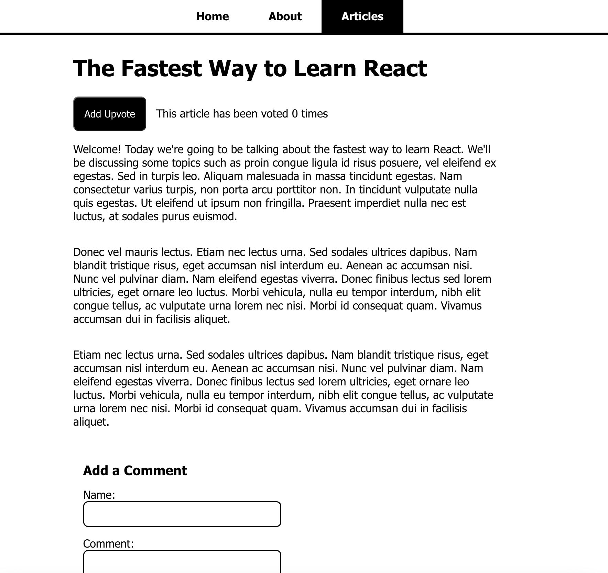

<!-- PROJECT TITLE -->
<br />
<div align="center">

<h2 align="center">MERN STACK</h3>
<p align="center"> This is a simple MERN web project</p>
<br />
</div>
<br/>

## About the project

In order to achieve a broader knowledge in tech stacks I've created this simple project that combines the use of M. MongoDB, E. Express, R. React, N. Node.js.

Here's why -> :rocket: [go fullstack!](https://martaboteller.com/fullstack)

<br/><br/>

## Description



<h5>Following the <a href="https://www.linkedin.com/learning/react-creating-and-hosting-a-full-stack-site/react-for-full-stack-solutions?autoplay=true&contextUrn=urn%3Ali%3AlyndaLearningPath%3A593715e0498e9e9be7fb8506">Shaun Wassell's Linkedin course</a> I've created a website blog. It has three pages. We've learned how to create an interface made with React components, develop a Node.js server and tie in a MongoDB database.</h5>

<br/><br/>

## Built with

Major frameworks/libraries used:

  

  

  

  
  
<br/><br/>

## What's included

I've been working with two main folders: frontend & backdend.

The structure of the frontend is as follows:

```
my-blog/
└── src/
    └─── components/
    │   ├── AddCommentForm.js
    │   ├── ArticlesList.js
    │   ├── CommentsList.js
    │   └── UpvotesSection.js
    └─── pages/
    │   ├── AboutPage.js
    │   ├── article-content.js
    │   ├── ArticleListPage.js
    │   ├── HomePage.js
    │   └── NotFoundPage.js
    ├── App.css
    ├── App.js
    ├── index.css
    ├── index.js
    └─  Navbar.js
```

The structure of the backend is as follows:

```
my-blog-backend/
└── src/
├── build/
├── server.js
└── utils/
```

<br/>

## Start local MongoDB

```
mongod --config /usr/local/etc/mongod.conf --fork
```

## Heroku preparation

<br/>

###### _At angular.json:_

```javascript
"options": {"outputPath": "../server/public",...
```

###### _Create the frontend dist:_

```
ng build
```

###### _At employee.service.ts_ - redefine URL_API

```
readonly URL_API = 'api/employees';
```

###### _Use env variables:_

```javascript
require('dotenv').config();
```

```
process.env.MONGO_CONNECTION_STRING
proess.env.PORT
```

###### _Define static route:_

```javascript
app.use(express.static(path.join(__dirname, '../public')));
```

###### _Redirect to frontend:_

```javascript
app.get('/', function (req, res) {
  res.sendFile('../public/index.html');
});
```

<br/><br/>

## Heroku deployment

<br/>

###### _Git preparation:_

```javascript
git init
git add .
git commit -m 'message'
```

###### _Heroku preparation:_

```javascript
heroku login
heroku create -a example-app
git remote -v //list all remote projects
heroku git:remote -a example-app
```

###### _Deploy:_

```javascript
git push heroku master
```

<br/><br/>

## Roadmap

- [x] Configure with local MongoDB database
- [x] Configure with atlas MongoDB database
- [x] Form validation check
- [ ] Amazon Web Services (AWS) deployment
- [ ] Resposive frontend
- [ ] Convert .subscribe() -> observables

<br/>

## Author

I'm Marta Boteller, little more about me at my [website](https://martaboteller.com).
<br/> <br/>

## Acknowledgments

<p>The Linkedin course is outdated I would like to thank William Hamilton and his  <a href="https://www.youtube.com/user/Draxy1980">Youtube channel</a>. He has created a video series in order to complete the course with the newer libraries still following along with Shaun's course.</p>

Please also find Shaun Wassell's course: [React: Creating and Hosting a Full-Stack Site](https://www.linkedin.com/learning/react-creating-and-hosting-a-full-stack-site/react-for-full-stack-solutions?autoplay=true&contextUrn=urn%3Ali%3AlyndaLearningPath%3A593715e0498e9e9be7fb8506)
